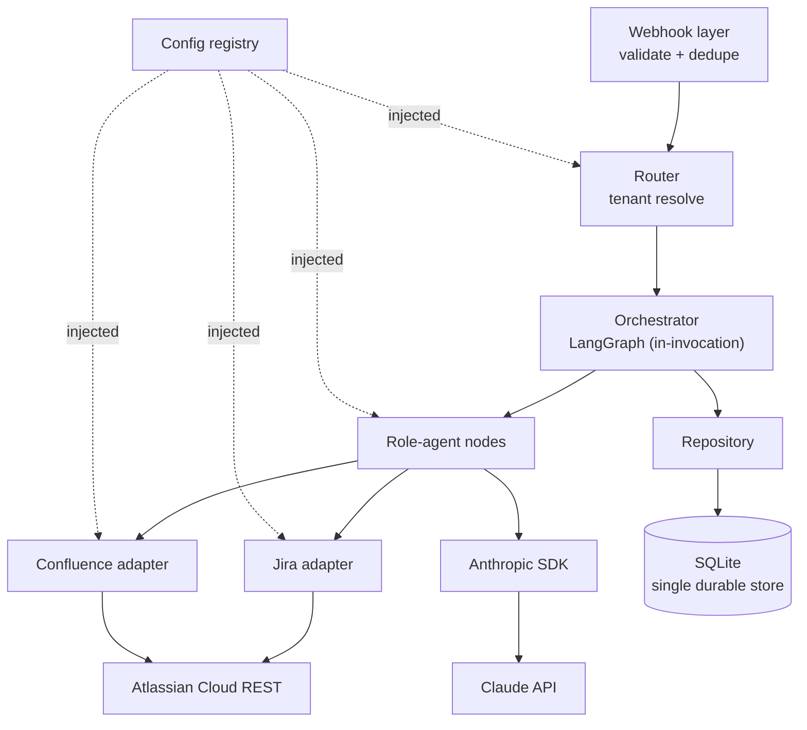
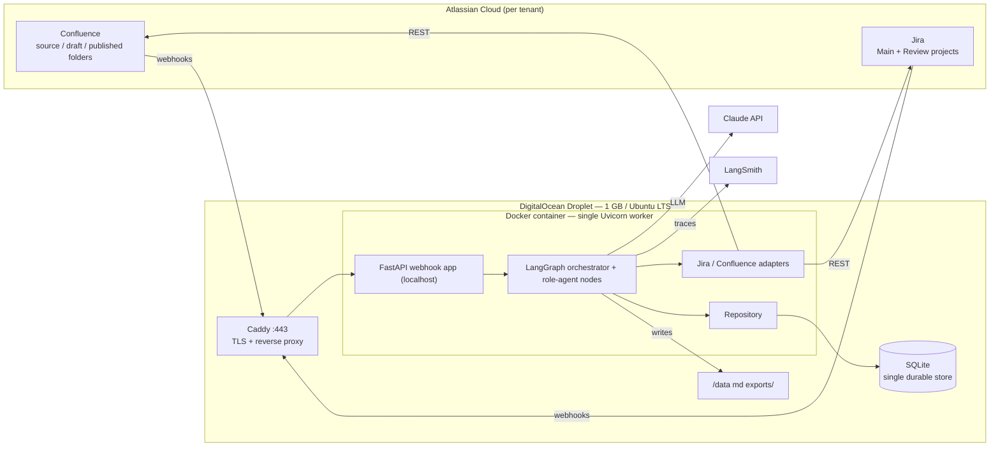
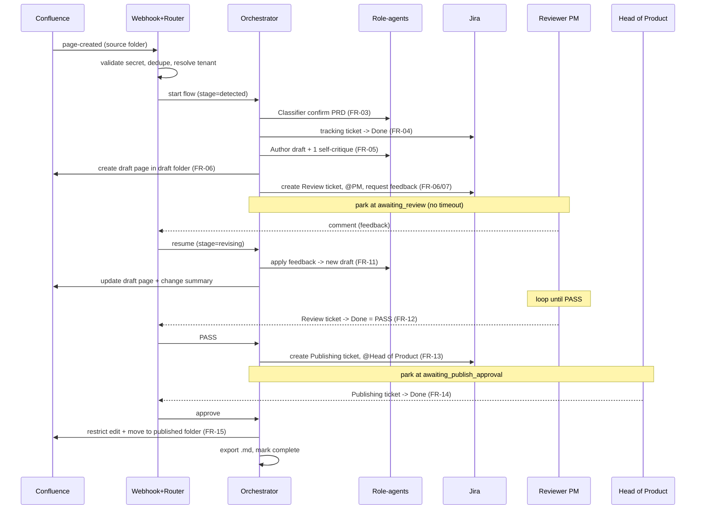
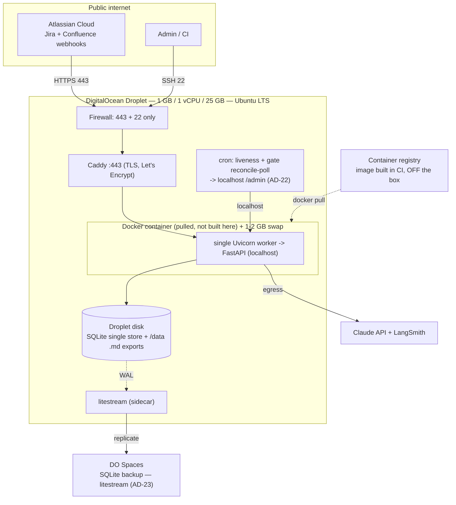

# Architecture Spine — PRD-to-UserDoc Automation Agent Flow

## Design Paradigm

**Event-driven pipeline of small, mostly-stateless steps over one authoritative state store** (pipes-and-filters), with a **multi-tenant router** in front and **LangGraph as the in-invocation orchestration / control-flow model** (not a durable store). Every unit of work is triggered by an Atlassian webhook, resolved to one tenant, then advanced one explicit stage at a time; **all durable state lives in a single SQLite store reached only through a repository** — LangGraph runs *inside* one webhook invocation to sequence the stages that can advance, then stops. Nothing about a flow is held implicitly in memory between events — a step is resumable because its state is on disk, and resume is correct because every externally-visible create is idempotent (AD-11).

Layer → directory map (detail owned by the code; this is the cold-start shape):

| Layer | Directory | Responsibility |
| --- | --- | --- |
| Webhook | `app/webhooks/` | Validate signature, parse event, dedupe (AD-9) |
| Router | `app/router.py` | Resolve tenant via config registry (AD-3) |
| Orchestrator | `app/orchestrator/` | In-invocation LangGraph graph, stage nodes (AD-6, AD-11) |
| Role-agents | `app/agents/` | Classifier, Ticket manager, Author, Feedback interpreter, Publisher, Error handler — each a graph node with its own prompt + `SKILL.md` |
| Adapters | `app/adapters/` | `jira.py`, `confluence.py`, `markdown.py` (AD-7) |
| Repository | `app/repository/` | State record (single durable truth), `processed_events` (AD-2, AD-9) |
| Config | `app/config/` | Per-tenant config registry (AD-4) |

## Invariants & Rules

The durable heart. `[ADOPTED]` = the PRD or a bound decision already settled it (do not re-litigate). `[RESOLVES §13.1]` = a decision handed to Architecture and decided here. `[HARDENING r2]` = a recoverability / durability control added in the 2026-07-24 roundtable update.

**Dependency direction (a rule, not a picture): outer depends inward; only adapters touch Atlassian and only the repository touches SQLite.**



### AD-1 — Layered boundaries with inward-only dependency [ADOPTED]

- **Binds:** all modules.
- **Prevents:** a role-agent (or the orchestrator) reaching Atlassian or SQLite directly, which would let it bypass the auth / retry / dedupe / version / ADF rules those layers enforce.
- **Rule:** dependencies point inward along Webhook → Router → Orchestrator → Role-agent nodes → {Adapters, Repository} → {Atlassian, SQLite}. Only the two adapters open an HTTP socket to Atlassian; only the repository runs SQL. Agent nodes and the orchestrator receive adapters and the repository by injection and never instantiate a transport or a DB connection themselves.

### AD-2 — The per-PRD state record is the single durable truth, owned and mutated only by the repository [ADOPTED]

- **Binds:** the §10 state record and its `stage`.
- **Prevents:** two writers of one entity; `stage` being inferred inconsistently from external Jira/Confluence status; and a second competing durable store.
- **Rule:** every read/write of the state record goes through repository methods (NFR-03; no raw SQL elsewhere). `stage` is an explicit enum (§9) advanced **only by the orchestrator** at a stage boundary — never written by a role-agent (agents return results; the orchestrator persists them) and never inferred from an Atlassian field. The business `stage` is authoritative over any Atlassian status. The **repository-owned SQLite file is the single authoritative durable store** for run state (there is no second durable store — AD-11); Atlassian holds the content artifacts but is **not** a run-state reconstruction source, so that store is backed up off-box (AD-23).

### AD-3 — Route-before-work tenant resolution [ADOPTED]

- **Binds:** webhook ingestion and every downstream step.
- **Prevents:** work executing without a resolved tenant, or one tenant's flow touching another's Jira/Confluence/state.
- **Rule:** every inbound event is mapped to exactly one tenant via the config registry (source folder / project key → tenant) **before any work happens**. The resolved tenant-config object is threaded through the whole flow; no step accesses a resource for a tenant it was not handed.

### AD-4 — Config isolation: no project literal outside the registry [ADOPTED]

- **Binds:** all modules, prompts, and `SKILL.md` files.
- **Prevents:** a hardcoded id in one unit silently breaking multi-tenant routing or the "modify by config only" contract (NFR-02/NFR-05).
- **Rule:** the config registry is the only home for project-specific literals (Jira project keys, Confluence space/folder ids, PM / Head-of-Product / admin account ids, credential refs, `md_export_dir`). None appears in code, prompts, or skill files; the source tree is grep-clean of them. Credentials are supplied by env reference, never inline.

### AD-5 — Serial queue is the concurrency-isolation unit [ADOPTED]

- **Binds:** the orchestrator / queue.
- **Prevents:** concurrent mutation of shared Atlassian/state resources in the demo, and a design that hard-codes single-flow assumptions and so precludes later parallelism.
- **Rule:** the demo processes exactly one PRD at a time; the state store tracks queued vs in-progress. The **per-PRD row (keyed by `prd_id`) is the unit of isolation** — no module may hold cross-PRD mutable singletons, so lifting the serializer later yields parallelism without a redesign.

### AD-6 — Orchestration + LLM runtime: LangGraph MIT core, Anthropic SDK, agents as nodes [ADOPTED]

- **Binds:** orchestrator, agent nodes, dependency manifest.
- **Prevents:** pulling in the Elastic-licensed server product (license cost + a server the 1 GB box cannot afford); divergent per-role runtimes/SDKs; and treating the graph framework as durable state.
- **Rule:** orchestration uses the **MIT-licensed `langgraph` core library only**, behind a self-built FastAPI wrapper — **no dependency on `langgraph-api` / the `langgraph dev|build` server product** (NFR-10). All six role-agents are per-role system-prompt + `SKILL.md` over one shared runtime, wired as graph nodes (not separate services). All LLM calls go through the **Anthropic Python SDK** (Claude API). LangGraph is the **in-invocation orchestration / control-flow model only** — it sequences stage nodes *within* a single webhook invocation and is **not** a durable state store; durable truth is the repository state record (AD-2, AD-11), and the graph's checkpointer is an ephemeral in-memory `InMemorySaver` (from the `langgraph-checkpoint` base bundled with the core), discarded when the invocation ends.

### AD-7 — Integration adapter contract [RESOLVES §13.1]

- **Binds:** every Atlassian call site.
- **Prevents:** scattered raw HTTP, inconsistent retry/auth, mixed API versions, and ADF built at some call sites but not others.
- **Rule:** all Atlassian access flows through two adapters — `JiraAdapter` and `ConfluenceAdapter` — exposing **domain** methods (e.g. `search_issue`, `get_transitions`, `transition_issue`, `add_comment(adf)`, `create_issue`, `get_page`, `create_page`, `move_page`, `set_edit_restriction`, `get/add_label`, `storage_to_markdown`). Adapters own: base-URL + version selection (Confluence v2 default, v1 for move/restrictions; Jira v3), env-ref token auth, retry-with-backoff (NFR-08, ~3 tries), **ADF construction for all comment/description bodies**, and normalization of failures into a single `AgentError` the Error handler consumes.

### AD-8 — Webhook ingress: validate → dedupe → route, in that order [ADOPTED]

- **Binds:** the webhook layer.
- **Prevents:** spoofed events triggering real Atlassian writes; duplicate deliveries entering the flow; work before a tenant is known.
- **Rule:** one public HTTPS endpoint receives all webhooks (Confluence page-created/updated; Jira comment-created + issue-updated). Each request is (1) validated by shared-secret/signature check, (2) dedupe-checked (AD-9; the key is *recorded* at flow admission, not on mere receipt), (3) routed to a tenant (AD-3) — and only then does work begin. A request failing (1), or whose key is already in `processed_events`, is dropped without side effects.

### AD-9 — Idempotency contract and the composite dedupe key [RESOLVES §13.1]

- **Binds:** every webhook handler.
- **Prevents:** duplicate deliveries double-processing (common on Jira/Confluence) **while** a genuine rename / `page-updated` still re-enters (NFR-04, EH-04); and two units disagreeing on the key (page-id-only would either loop or drop renames).
- **Rule:** the idempotency key is the composite **`<tenant_id>:<event_type>:<entity_id>:<version_marker>`**:
  - Confluence page events → `entity_id` = page id, `version_marker` = page `version.number` (monotonic int; bumps on every edit incl. rename/move).
  - Jira comment-created → `entity_id` = comment id (unique).
  - Jira issue-updated/transition → `entity_id` = issue key, `version_marker` = the changelog (history) id of that transition.

  Keys live in a **repository-owned `processed_events` table** (per-tenant, with a **UNIQUE constraint** on the composite key), **NOT nested in a PRD row** (a page-created event arrives before any PRD row exists). `processed_events` is the **single authoritative** dedupe store; the §10 `dedupe_keys` field is at most a read-only per-PRD projection of it, **never a second write target**. The webhook layer **checks** the key at ingestion but **records** it transactionally with the first state write that admits the PRD to the flow (the `detected` checkpoint) — so "processed" means "admitted": a concurrent duplicate loses the UNIQUE-insert race and is dropped safely, and a crash *before* admission leaves the key unrecorded so the event is safely redelivered rather than lost.

### AD-10 — Detection-exclusion guard for the agent's own pages [RESOLVES §13.1]

- **Binds:** detection (FR-01) and the Publisher (FR-15).
- **Prevents:** the agent's own published output being re-ingested into an infinite draft loop.
- **Rule:** a page enters detection **only if** (a) its location resolves to the tenant `confluence_source_folder_id` **and** (b) it does **not** carry the reserved system label `agent-generated` **and** (c) its creator accountId is not the agent's own account. The primary guard is structural — the published folder is a different (adjacent) id, so published pages are never in the watched set; (b) and (c) are defense-in-depth. The Publisher stamps `agent-generated` on every page it creates/publishes. The reserved label is a fixed **system constant** (identical across tenants), so it does not violate AD-4. The **agent's own account id** (used by check (c) here and by AD-18's restriction) has one source: it is resolved once per tenant via the adapter (`get_current_user` / `/myself`, since each tenant's token is a different account) and cached — never guessed independently by two units.

### AD-11 — Single authoritative store; resume is idempotent-create replay of the stage [RESOLVES §13.1]

- **Binds:** orchestrator + repository.
- **Prevents:** double-create / re-publish on resume; inconsistent sub-stage-vs-whole-flow resume; and — by construction — any divergence between two durable stores, because there is now only one.
- **Rule:** the **repository-owned SQLite state record is the single authoritative durable store**, and the resumable unit is the **§9 stage**. **LangGraph is in-invocation control flow only:** on each webhook the orchestrator (1) **loads the state record**, (2) **(re)enters the graph** at the stage recorded there (`stage` / `last_good_checkpoint`, both fields of the state record — a business cursor, not a LangGraph pointer), (3) runs the stages that **can advance without a new external event**, (4) **persists** the new `stage` + any recorded ids through the repository, and (5) **stops**. LangGraph's own checkpointer is an **in-memory `InMemorySaver` scoped to that one invocation** (the in-invocation graph is keyed `thread_id = prd_id`) — it is **not** a cross-webhook durable store, so there is nothing to reconcile and no second store that could drift. **Resume correctness = idempotent-create replay:** every externally-visible create (draft page, Review / tracking / Publishing ticket) is guarded by the id already recorded in the state record (`userdoc_page_id`, `review_ticket_key`, `prd_tracking_ticket_key`, `publishing_ticket_key`) — the step **reuses** the id if present and, if absent, does a **find-or-create keyed on a deterministic marker**, not a blind create. This matters because a create can succeed remotely a beat before its id is persisted (a crash in that window): so "absent" first **searches** for an artifact carrying the run's correlation marker — the `prd_id`, stamped as a Jira label / entity property and a Confluence content property — and **adopts an orphan if found**, creating only when there is genuinely none; the resulting id is persisted in the **same repository transaction that advances the `stage`**. Re-running a failed or replayed stage therefore **converges** and never double-creates; EH-02 resume re-enters at `last_good_checkpoint` (the failed stage), never from the start. Because the durable store is authoritative-only-on-disk, it is replicated off-box (AD-23).

### AD-12 — Confluence → Jira identity is the shared accountId [RESOLVES §13.1]

- **Binds:** the Ticket manager (FR-02a rename-task assignment).
- **Prevents:** assigning the config Reviewer PM instead of the actual page author, inventing a mapping service, or silently mis-assigning across orgs when the `accountId`s differ.
- **Rule:** within one Atlassian org the `accountId` is shared across Jira and Confluence, so the **Uploading PM = the Confluence page-creator `accountId` resolved at runtime from the event**, used directly as the Jira assignee — no mapping table for the same-org common case. **Cross-org fallback ships (full hardening):** a config `identity_overrides` map (Confluence → Jira accountId) is consulted first, then an **email-match fallback** resolves the assignee when the two orgs do not share an `accountId`; only **fully-automatic cross-org auto-resolution** (deriving the mapping with neither an override nor an email match) is deferred.

### AD-13 — Jira transition legality; agent auto-transitions only the tracking ticket [RESOLVES §13.1]

- **Binds:** the Ticket manager.
- **Prevents:** assuming a direct-to-Done path exists, double-transitioning an already-Done ticket, getting stuck when Done requires an intermediate state, and an agent short-circuiting a human gate.
- **Rule:** to drive a ticket to Done: (1) read current status; (2) if `statusCategory.key == "done"` → **skip** (idempotent, FR-04); (3) else `GET /issue/{key}/transitions` for the legal set from the current status; (4) if a transition whose target status has category `done` exists → perform it; (5) if none is directly available → consult the **config-declared preferred transition path** and **traverse it hop-by-hop** (full hardening), re-reading the legal set at each hop and stopping at the first `done`-category status; **escalate to the admin (EH-01) only if** no preferred path is configured or a required hop is illegal from the current status. Fully-automatic workflow-graph path-search (no configured path) is deferred. "Done-ness" is judged by `statusCategory == done`, **not** a literal name. The agent auto-transitions **only the PRD-tracking ticket**; it **must never transition a human-gate ticket** (Review/Publishing) — see AD-15.

### AD-14 — Confluence folder model: first-class ids, placement via v1 move [RESOLVES §13.1]

- **Binds:** Confluence adapter + detection + Publisher.
- **Prevents:** adapters modeling folders inconsistently (some as parent pages, some as folder ids) and failed placements via the broken `parentId` path.
- **Rule:** Confluence folders are first-class and addressable by id (v2 folders API: `GET /wiki/api/v2/folders/{id}` + `/children` + `/spaces/{id}/folders`); config stores source/draft/published **folder ids**. Placing a page **into** a folder uses the **v1 move endpoint** `PUT /wiki/rest/api/content/{id}/move/append/{folderId}` (the v2 create/update `parentId` returns 500 for folder parents). Detection's location check compares the page's folder/ancestor id to `confluence_source_folder_id`.

### AD-15 — Human-gate approval model: Done-by-a-human is the only signal [ADOPTED]

- **Binds:** orchestrator + Feedback interpreter + Publisher.
- **Prevents:** an agent short-circuiting a human gate, or two units disagreeing on what "approved" means.
- **Rule:** the sole approval signal at each gate is a **human** transitioning the gate ticket into a `done`-category status — Review ticket Done = PASS (FR-12); Publishing ticket Done = approve-to-publish (FR-14) — detected via the issue-updated webhook. The agent **detects** gate Done and **never transitions a gate ticket itself**. On no human action the run **parks** at `awaiting_review` / `awaiting_publish_approval` indefinitely (no timeout, no auto-escalation). Feedback added after Done is ignored (EH-06); non-Done terminal transitions + reassignment are out of demo scope — park (EH-09).

### AD-16 — Loop safety: block on humans, never self-spin [ADOPTED]

- **Binds:** Feedback interpreter + Author + orchestrator.
- **Prevents:** an autonomous spin or self-approval, inconsistent "when to ask" judgment, and stage-routing hidden in untestable prose.
- **Rule:** the clarification loop (FR-08, **only** its 4 enumerated triggers) and the plain-language structure-confirmation loop (FR-10) **block on a human reply** and must never fabricate the answer or auto-advance (EH-08); outside the 4 triggers the agent proceeds with a **stated** assumption. The redraft loop (FR-07 → FR-11) is uncapped but **cannot self-spin** — each round requires a fresh human PM feedback comment; `review_round` increments per applied round and is surfaced with per-round token cost in LangSmith as the guardrail (no hard cap, NFR-09). The Feedback interpreter node returns a **typed `FeedbackDecision{route, trigger, assumption}`** (defined in `app/domain/`); the orchestrator's **stage routing is deterministic and unit-tested on hand-built `FeedbackDecision` objects**, while **only the LLM that produces the decision is eval-tested** (held-out set, AD-17) — so which stage a feedback goes to never lives in untestable prose.
- **Amendment 2026-07-25 (conversational context).** The Feedback interpreter is given the **review-ticket transcript** (PM/agent-labelled, from the Jira comment thread) and the **pending restatement** as *input* on every interpretation, so a reply is judged in-conversation (FR-10a). This is an **input enrichment only** — the AD-16 contract is unchanged: the interpreter still emits a typed `FeedbackDecision`, and routing stays deterministic and unit-tested. The transcript read is best-effort (a Jira hiccup degrades to no transcript, never a failed round). A rejected restatement (*"no"*) returns to `awaiting_review` — a state-machine edge added to the §9 machine as part of this amendment.

### AD-17 — Acceptance oracles: the human PASS is the only quality gate [ADOPTED]

- **Binds:** Author + Classifier.
- **Prevents:** treating self-critique as an approval gate (bypassing the human); shipping a Classifier with no measurable bar; and a Classifier bar gamed by train-on-test or passed on a single flaky run.
- **Rule:** the **human PM PASS (FR-12) is the sole content-quality acceptance** of the UserDoc; the Author runs exactly **one** draft → critique → revise self-critique pass as a drafting aid that never signals done-ness (FR-05). The Classifier's objective bar is **0 false-positives / 0 false-negatives on a held-out fixture set** (FR-03 rubric): fixtures split into `fixtures/classifier/dev/` and `fixtures/classifier/holdout/` — the **dev** set tunes the prompt, the **0-FP/0-FN bar applies to the `holdout` set only** (no train-on-test). Acceptance is a **distribution, not a single boolean**: the eval runs **three times**, emits a **confusion matrix + a flake budget**, and the classifier **model id is pinned in config** (AD-4). Both fixture sets are build deliverables.

### AD-18 — Publish transaction: ordered, idempotent, self-inclusive [RESOLVES §13.1]

- **Binds:** the Publisher.
- **Prevents:** partial-publish inconsistency, accidental self-lockout, re-ingestion, and a resume re-applying an already-completed side-effect.
- **Rule:** on Publishing-ticket Done the Publisher performs, **in order**, four side-effects, **each guarded by its own idempotency marker / sub-checkpoint in the state record** so a resume of the `publishing` stage **skips the completed side-effects and never re-applies** one: (1) apply Confluence **edit** restriction (update-restriction) that **must include the agent account** (the one resolved in AD-10) and space admins, or the API 400s / locks out — this restricts *who may edit*, it is **not** a content freeze or version pin (a re-apply must still include the agent account); (2) **move** the page via v1 move/append into `confluence_published_folder_id` (a **no-op if the page is already placed** there); (3) **export** storage → Markdown (markdownify) to the tenant `md_export_dir` on server disk; (4) mark state `complete`. Per-side-effect idempotency is a **tested deliverable**.

### AD-19 — Error and resume contract [ADOPTED]

- **Binds:** Error handler + orchestrator.
- **Prevents:** divergent error surfaces, whole-flow restarts, and double-resume.
- **Rule:** on any error after NFR-08 retries the orchestrator sets `stage = error` preserving `last_good_checkpoint` + `pending_gate`, and the Error handler posts **exactly one** structured comment on the relevant ticket: plain-language error + suggested fix + `@admin` (config) + the literal resume instruction ("Reply `@agent resume` or `fixed` on this comment and I'll retry from where I stopped") + a correlation id logged to LangSmith (EH-01). An admin comment webhook on that ticket containing `@agent resume` / `fixed` re-runs from `last_good_checkpoint` (the failed **stage**, AD-11), never the whole flow; that resume comment is dedupe-guarded (AD-9) so a duplicate delivery cannot double-resume (EH-02).

### AD-20 — Observability: 100% of LLM calls traced in LangSmith [ADOPTED]

- **Binds:** every agent node.
- **Prevents:** untraced LLM spend and an unobservable runaway redraft loop.
- **Rule:** every LLM call is traced in LangSmith with latency, tokens, and cost, carrying the run's correlation id and `review_round` (NFR-01/NFR-09). Data-governance: the demo traces **non-confidential test PRDs only** (PRD-signed-off). A **content-gating config flag** governs *what* content is attached to a trace — the seam that later distinguishes metadata-only from full-content tracing — while full redaction/retention for confidential content stays deferred to production. **Secrets (production item):** each tenant's Atlassian token lives in the single `.env`, so that file's blast radius is *every* tenant; production must scope and rotate per-tenant credentials. The demo keeps the single `.env` per the PRD's signed-off stance.

### AD-21 — Operational envelope: the 1 GB box is a first-class constraint [ADOPTED]

- **Binds:** packaging, host topology, runtime dependency choices.
- **Prevents:** on-box Docker builds OOMing, multi-worker RAM blowout, exposing FastAPI directly, and memory growth that breaks "stable on 1 GB" (NFR-11).
- **Rule:** ship a **single Docker image (slim Python base)** built **off the Droplet** (CI/registry) and **pulled** — never built on the box; run a **single Uvicorn worker** with FastAPI bound to **localhost** behind **Caddy** (TLS via Let's Encrypt); firewall opens **only 443 + 22**; add a **1–2 GB swap file**. **At most one PRD resident in memory** (the serial queue is a memory-safety measure), **no co-located DB server** (SQLite is in-process), lean deps only. Host: 1 GB / 1 vCPU / 25 GB DigitalOcean Droplet, Ubuntu LTS. 1 GB is **reversible** — resize up if the §12 end-to-end run OOMs; hard-code no 1-GB-only assumption. Any scheduled sidecar (the AD-22 reconciler, the AD-23 backup agent) must fit the same envelope — small, single-worker-friendly, no second always-on app process competing for RAM.

### AD-22 — Reconciliation & liveness sweep [HARDENING r2]

- **Binds:** the reconciler, the orchestrator, the Jira adapter.
- **Prevents:** a silently-dropped (best-effort) gate webhook stranding a correct human indefinitely, and parked runs emitting zero liveness signal.
- **Rule:** a **lightweight scheduled reconciler** runs on a fixed interval within the AD-21 envelope — **default: system `cron` on the Droplet calling an authenticated `localhost` admin endpoint** (no extra Python dependency, no always-on background thread); an in-process scheduler (e.g. APScheduler) is the alternative. The reconciler writes **only non-`stage` markers through the repository and never advances `stage` itself** (AD-2); a gate it finds Done is fed as an input, not written as a transition. Each sweep does two things. **(a) Liveness:** find runs in `awaiting_review` / `awaiting_publish_approval` / `error` whose `updated_at` is older than a threshold and **alert** through the EH-01 admin surface plus a log / LangSmith signal, so a stuck or silently-dropped-webhook run becomes visible; the alert is **recorded once per threshold crossing** (a `liveness_alerted_at` marker) so a stuck run is not re-alerted every sweep. **(b) Reconcile-poll:** re-poll the **two gate tickets** via the `JiraAdapter`; if a gate ticket is now `statusCategory == done`, feed that as an **input** to the orchestrator — identical in effect to the missed `issue-updated` webhook. This is an **input, not a state write**: the orchestrator remains the sole `stage` writer (AD-2), the agent still **never transitions a gate ticket** (AD-15), and indefinite-park semantics are **unchanged** — this adds recoverability and observability, **not a timeout**. **A gate-Done cannot double-advance a stage**, three independent ways: (i) reconcile findings are admitted through the **same webhook/admission + serial-queue path** (AD-5) — never a concurrent graph entry; (ii) the reconcile-poll derives the **same AD-9 dedupe key** (issue key + the changelog history id of the to-`done` transition, read via the adapter), so a webhook and a poll that observe the same transition **collide on the `processed_events` UNIQUE constraint** and one is dropped; and (iii) the orchestrator's stage advance is **idempotent** — a gate-Done arriving when the run has already advanced past that gate is a **no-op** (the same guard as AD-11 idempotent replay). This un-defers the **minimal polling fallback for the two gates only** (general event polling stays deferred, §13 Q3).

### AD-23 — State durability: the single store is backed up off-box [HARDENING r2]

- **Binds:** deploy / ops, and the repository's on-disk store.
- **Prevents:** unrecoverable loss of run state (now authoritative-only-on-disk), and the post-crash double-create / re-publish a lost `processed_events` + recorded-ids table would cause on webhook redelivery.
- **Rule:** because `last_good_checkpoint`, `processed_events`, and the recorded external ids are **authoritative only on the Droplet disk** (AD-2 / AD-11) — Atlassian is **not** a full run-state reconstruction source — the single SQLite store is **replicated off-box**. **Default: `litestream` (pin `>= 0.5.4`; 0.5.15 current)** continuously streaming the SQLite WAL to **DigitalOcean Spaces** (S3-compatible), running as a **small-RAM sidecar / host process** inside the AD-21 envelope; **alternative:** an hourly `sqlite3 .backup` + `/data` tar pushed to Spaces via `cron`. Restore is point-in-time from the replica. The backup is **built for the demo** (full hardening), not merely noted as a seam.

### AD-24 — Admission is once-per-PRD; rename churn is dropped at the door [AMENDMENT 2026-07-25]

- **Binds:** the webhook router (`_dispatch_page`), detection.
- **Prevents:** an already-drafted PRD being re-caught — and producing duplicate tickets/drafts — as its source page is renamed back and forth (each rename is a new version, so AD-9 version-dedup alone does not stop it); and stray pages elsewhere in the space leaving dead `detected` rows in the one store.
- **Rule:** for an **existing** run, a source `page` event is actionable **only** while the run is parked awaiting a corrected re-upload (`pending_gate == UPLOADING_PM_RENAME`, i.e. FR-02a title mismatch at `detected` or EH-07 reject at `confirmed`); any other existing state drops the event **before** the version-resolving GET. A re-entry's dedupe key is recorded **after** the advance, not before, so a crash mid-advance lets the redelivery re-advance (idempotent) instead of stranding the run behind a committed-but-unworked key. A **new** page is admitted **only if it is in the watched source folder** (container or ancestors), refusing stray-space pages at the door rather than letting detection leave a dead row. Detection re-checks folder/label/author as defense in depth.

### AD-25 — Draft-deletion detection & human-gated recovery [AMENDMENT 2026-07-26]

- **Binds:** the webhook router, the Publisher, the Feedback interpreter, the orchestrator, the Confluence adapter.
- **Prevents:** a human deleting the UserDoc draft mid-flow silently stranding the run — **and** the agent silently restoring a page a human may have deleted on purpose.
- **Rule:** detection keys on the page's real **status**, not the webhook label — a page event whose id is a run's `userdoc_page_id` and whose live status is `trashed`/missing is a deletion, even when the Automation rule fired a generic *page-updated* (the common misconfiguration). The agent then **asks before acting** (AD-16 / EH-08 spirit): `apply_draft_deleted` posts a question on the Review ticket **@-mentioning the Reviewer PM** — "was the deletion intentional?" — and parks with `pending_gate = PM_DELETION_DECISION` and a `pending_deletion_page_id` marker; it touches nothing. The PM's reply routes (while the marker is set) to `apply_deletion_decision`, which classifies it into a typed **RESTORE / LEAVE / UNCLEAR** decision (Feedback interpreter; deterministic routing per AD-16) and: **RESTORE** → restore-in-place (v1 content PUT `status: current`; no untrash endpoint exists), else recreate with the trashed page's still-readable latest content (stamped, repointed), then self-heal an errored run at `last_good_checkpoint`; **LEAVE** → acknowledge, leave it deleted; **UNCLEAR** → re-ask, never guess. Idempotent (a redelivery finds a decision already pending, or the page current, → no-op). The **publish transaction never auto-recovers** either: a missing/trashed draft at publish makes `on_publishing` raise an actionable error, not restore silently. A trashed page that is not a tracked draft is ignored. `pending_deletion_page_id` is a new `prd_state` column added by an idempotent additive migration (an existing store on disk is `ALTER`-ed in at open).

## Consistency Conventions

| Concern | Convention |
| --- | --- |
| Naming | Stages = snake_case enum from §9 (`detected`, `confirmed`, `prd_ticket_done`, `drafted`, `awaiting_review`, `awaiting_clarification`, `awaiting_structure_confirm`, `revising`, `passed`, `awaiting_publish_approval`, `publishing`, `complete`, `error`). Agents = `<role>_agent`. Adapters expose domain verbs, not HTTP. |
| Ids | `prd_id` = Confluence page id (stable key); Jira references by issue **key**; tenant by `project_id`. Dedupe key = `<tenant>:<event_type>:<entity>:<version_marker>` (AD-9). |
| Data & formats | Timestamps ISO-8601 UTC. Jira comment/description bodies = **ADF** (never a plain string). Errors = single `AgentError` type normalized by adapters. Confluence content read as storage format, converted with markdownify. |
| State & cross-cutting | State mutated **only** via repository; `stage` advanced **only** by orchestrator (AD-2). The repository SQLite file is the **single durable store** (AD-2/AD-11), replicated off-box (AD-23). Config injected as a tenant-config object; secrets via env refs only (AD-4). Every LLM call traced in LangSmith with correlation id (AD-20). Transient API failures retried with backoff **inside adapters** (AD-7). |

## Stack

Verified current on 2026-07-23; `litestream` and the base checkpoint package re-verified 2026-07-24 (sources in `.memlog.md`). The code owns this once it exists; pin exact patch at build.

| Name | Version |
| --- | --- |
| Python | 3.12 (`python:3.12-slim`) |
| FastAPI | 0.136.3 |
| Uvicorn | 0.51.0 |
| LangGraph (MIT core `langgraph`) | 1.2.9 |
| langgraph-checkpoint (base; `InMemorySaver`, in-invocation, transitive of core) | 4.1.1 (langgraph core pins `>=3.0.1,<5`) |
| Anthropic SDK (`anthropic`) | 0.117.0 |
| LangSmith (`langsmith`) | 0.10.9 |
| markdownify | 1.2.3 |
| Caddy | 2.11.4 |
| litestream (SQLite WAL → DO Spaces, AD-23) | 0.5.15 (pin `>= 0.5.4`) |
| SQLite | stdlib `sqlite3` (bundled with Python 3.12) |
| Jira Cloud REST API | v3 |
| Confluence Cloud REST API | v2 (+ v1 for move & content-restriction endpoints) |

## Structural Seed

Container / runtime view:



Happy-path sequence (detect → draft → review-loop → publish):



Deployment (the operational envelope AD-21 owns):



Source tree (cold-start scaffold; the code owns the detail):

```text
{root}/
  app/
    main.py           # FastAPI app + single webhook entrypoint
    webhooks/         # signature validation, event parsing, dedupe check (AD-8/AD-9)
    router.py         # tenant resolution via config registry (AD-3)
    orchestrator/     # in-invocation LangGraph graph, stage nodes; stage cursor lives in the state record (AD-11)
    agents/           # classifier, ticket_manager, author, feedback_interpreter,
                      #   publisher, error_handler  (each: node + prompt + SKILL.md)
    adapters/         # jira.py, confluence.py (AD-7), markdown.py (storage->md)
    repository/       # state record (single durable truth) + processed_events (AD-2/AD-9)
    config/           # config registry loader + tenant-config schema (AD-4)
    domain/           # state model, stage enum, FeedbackDecision, AgentError, ADF helpers (AD-16)
    admin/            # authenticated localhost reconcile/liveness endpoint (AD-22)
  fixtures/
    classifier/{dev,holdout}/   # labeled ACCEPT/REJECT PRD pages; holdout is the 0-FP/0-FN bar (AD-17)
  deploy/             # Dockerfile (slim), Caddyfile, swap + firewall, litestream + cron reconcile (AD-22/AD-23)
  tests/
```

## Capability → Architecture Map

| Capability / Area | Lives in | Governed by |
| --- | --- | --- |
| FR-01 detect + self-ingestion guard | `webhooks/`, detection | AD-8, AD-9, AD-10, AD-14 |
| FR-02/02a title gate + rename task | Ticket manager, Classifier | AD-12, AD-13 |
| FR-03 PRD confirmation | Classifier agent | AD-17 |
| FR-04 tracking ticket → Done | Ticket manager | AD-13 |
| FR-05 first draft + self-critique | Author agent | AD-17 |
| FR-06/07 draft page + Review ticket | Author, Ticket manager, Confluence adapter | AD-7, AD-14, AD-15 |
| FR-08/09/10/11 feedback + revise loop | Feedback interpreter, Author | AD-16 |
| FR-12/13/14 PASS + publish gate | Orchestrator, Ticket manager | AD-15 |
| FR-15 publish (restrict/move/export) | Publisher, Confluence adapter | AD-14, AD-18, AD-10 |
| §10 state / §9 stages | Repository, orchestrator | AD-2, AD-11 |
| NFR-03 repository / SQLite | Repository | AD-1, AD-2 |
| NFR-04 idempotency | Webhook layer, repository | AD-9 |
| NFR-05 config isolation | Config registry | AD-4 |
| NFR-06 serial queue | Orchestrator | AD-5 |
| NFR-01/09 observability | All agent nodes | AD-20 |
| NFR-10 licensing | Orchestrator, deps | AD-6 |
| NFR-07/11 + §15 deploy/memory | Packaging, host | AD-21 |
| EH-01/02 error + resume | Error handler, orchestrator | AD-19, AD-11 |
| EH-04 rename re-trigger | Webhook layer | AD-9 |
| EH-05 concurrency / queue | Orchestrator | AD-5 |
| EH-06/07/08 late-feedback / ambiguous PRD / loop-block | Feedback interpreter, Classifier | AD-15, AD-17, AD-16 |
| EH-09 non-Done / indefinite stall | Orchestrator | AD-15, AD-22 |
| Liveness + dropped-gate-webhook recovery (§13 Q3) | Reconciler, orchestrator, Jira adapter | AD-22 |
| State durability / disaster recovery | Ops, repository | AD-23 |
| Classifier eval: held-out fixtures, ×3, confusion matrix | Classifier, `fixtures/classifier/` | AD-17 |
| Feedback routing via typed FeedbackDecision | Feedback interpreter, orchestrator, `domain/` | AD-16 |

## Deferred

Intentionally pushed down — each can wait, and none lets two units diverge inside the demo scope. **Scope note (r2):** the demo-trim proposed for AD-9 (multi-shape dedupe), AD-12 (cross-org identity fallback), and AD-13 (multi-hop transition handling) was **rejected** — all three ship fully specced and in build scope (full hardening). What remains deferred:

- **SQLite → Postgres** for parallel multi-tenant — via the repository (AD-2); LangGraph is in-invocation only (AD-11), so no checkpoint-store migration is entailed. Seam only.
- **True parallel multi-tenant execution** — the per-PRD row is already the isolation unit (AD-5); lift the serializer later.
- **RAG over published docs** for house style; **SSG build/deploy** downstream of the exported `.md`; **fixed doc template**; **multi-approver publishing** — all out of demo scope (§5.2/§5.3).
- **Fully-automatic cross-org identity auto-resolution** and **fully-automatic Jira workflow-graph path-search** — the AD-12 override/email *fallback* and the AD-13 config-declared multi-hop *path* now ship; only the zero-configuration automatic variants wait.
- **LangSmith redaction/retention** for confidential content — post-demo; the AD-20 content-gating config flag is the seam already in place.
- **Exact webhook registration mechanism** (Connect app vs admin/Automation webhook) and confirming the page-created payload carries the creator accountId — instance-dependent, verify against the real tenant; does not change the boundary architecture (open question). The dropped-webhook risk this raised is now mitigated in-scope by the AD-22 reconcile-poll for the two gates (general event polling stays deferred).
