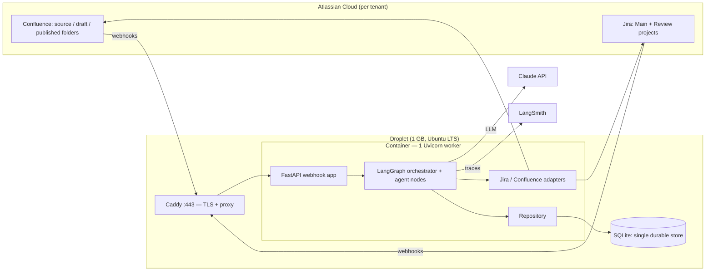
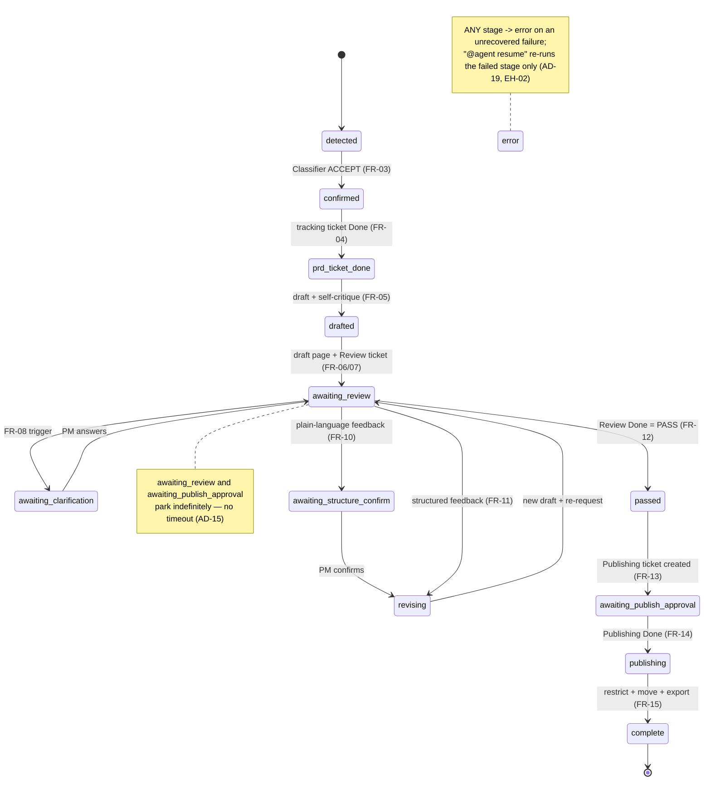
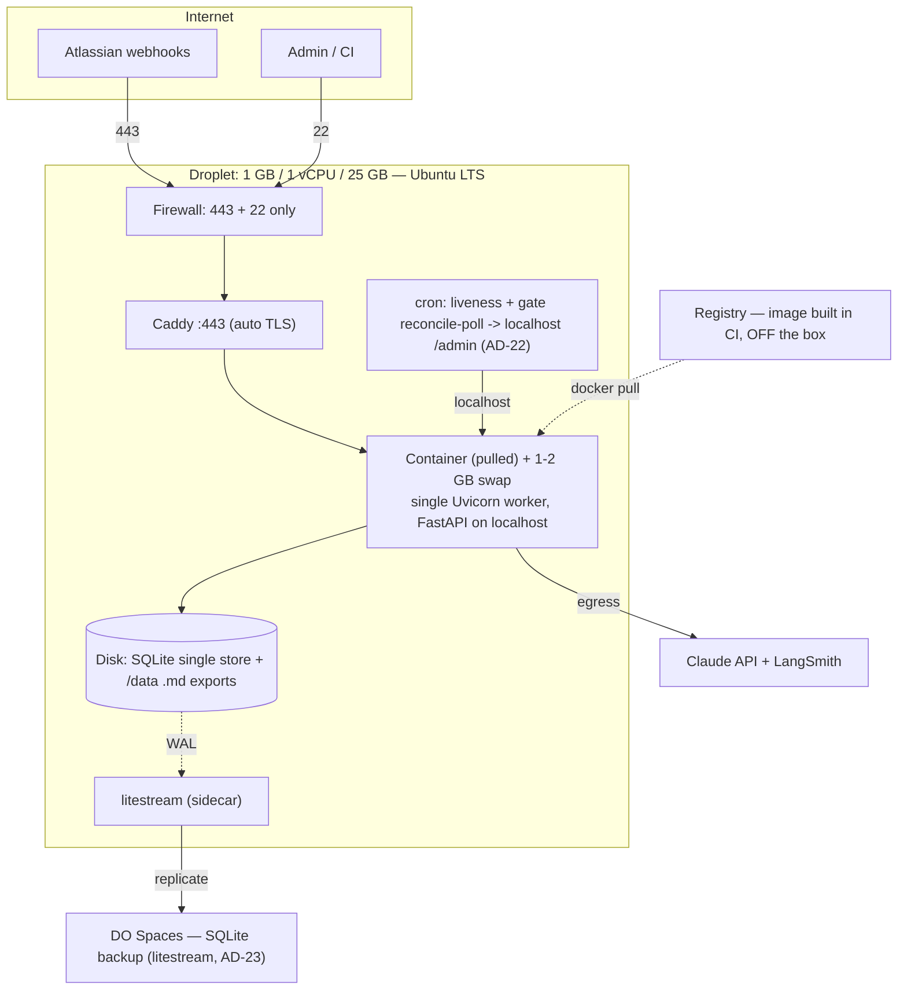

# Solution Design — PRD-to-UserDoc Automation Agent Flow

**Companion to** `ARCHITECTURE-SPINE.md` (the binding contract). This document is the readable walkthrough; where they differ, the spine wins. AD IDs (`AD-1`…`AD-23`) are stable and cited throughout.

**Status:** final · **Date:** 2026-07-24 (r2) · **Altitude:** feature (this system decomposes into epics next) · **Scope:** demo (SQLite, one PRD at a time)

> **r2 update (2026-07-24):** AD-11 rewritten — one authoritative store + idempotent-create replay, replacing the old two-store "one transaction" model; LangGraph is in-invocation control flow only. Added AD-22 (reconciliation & liveness sweep) and AD-23 (state backup/DR). Classifier eval moved to held-out fixtures; feedback routing via a typed `FeedbackDecision`. Full-hardening scope (AD-9/12/13 kept, not trimmed).

---

## 1. What this system is

A finalized PRD lands in a watched Confluence folder. From that single event the service drafts an end-user help document, drives a human review loop through Jira, waits for two human approvals, and — only then — publishes the doc and exports it as Markdown. Jira and Confluence are the entire human interface; there is no bespoke UI.

The design is deliberately **not one big agent**. It is an **event-driven pipeline of small, mostly-stateless steps over one authoritative state store** (the paradigm). Each step is triggered by a webhook, does one thing, writes its result to SQLite, and stops. Because every step's state is on disk, the flow can park for days waiting on a human, survive a restart, and resume exactly where it stopped — safely, because every externally-visible create is idempotent (AD-11). **LangGraph is the in-invocation control-flow model** that sequences those steps *within a single webhook invocation*; it is not a durable store. A thin **FastAPI** app is the front door.

Two ideas carry most of the weight:

- **The state store is the spine of the runtime, not the framework.** Atlassian holds the authoritative *content* (pages, tickets, comments), but our **run state** — the per-PRD record, the dedupe log, and the recorded external ids — is durable in exactly **one** small SQLite store (AD-2). That state is **not** fully reconstructable from Atlassian: lose the disk mid-run and a redelivered webhook would double-create or re-publish. So the store is the single authoritative truth, and it is streamed off-box to object storage (AD-23).
- **The 1 GB box is a design input, not an afterthought** (AD-21). LangGraph raises the RAM stakes, so the memory envelope is treated as a first-class invariant: one PRD in memory at a time, a single worker, lean dependencies, no co-located database. Any scheduled sidecar (the AD-22 reconciler, the AD-23 backup) lives inside that envelope too.

---

## 2. The components



Reading inward (the dependency rule is AD-1 — outer depends inward, and **only adapters touch Atlassian, only the repository touches SQLite**):

- **Webhook layer** (`app/webhooks/`) — the one public endpoint. It validates the shared secret/signature, deduplicates, and only then admits the event (AD-8). A spoofed or duplicate request dies here with no side effects.
- **Router** (`app/router.py`) — resolves the event to exactly one tenant via the config registry *before any work* (AD-3). No step ever runs without a known tenant.
- **Orchestrator** (`app/orchestrator/`) — the LangGraph graph, run *inside* a webhook invocation only (AD-6). It owns stage transitions and is the *only* component that advances the business `stage` (AD-2, AD-11); it keeps no durable checkpoint of its own.
- **Role-agent nodes** (`app/agents/`) — Classifier, Ticket manager, Author, Feedback interpreter, Publisher, Error handler. Each is a system prompt + `SKILL.md` over one shared runtime, wired as a graph node (AD-6). They reason and call adapters; they never write state or open sockets themselves.
- **Adapters** (`app/adapters/`) — `JiraAdapter`, `ConfluenceAdapter`, and a `markdown` converter. They are the single choke point for all Atlassian I/O (AD-7).
- **Repository** (`app/repository/`) — the sole owner of SQLite, the **single durable store**: the per-PRD state record and the `processed_events` dedupe log (AD-2, AD-9, AD-11).
- **Config registry** (`app/config/`) — the only place project-specific literals live (AD-4).

**The six agents map to jobs, not services.** Classifier confirms a page is a real PRD (accepted against a **held-out** fixture set — the eval runs ×3 and emits a confusion matrix + flake budget, with the model id pinned in config, AD-17); Ticket manager does all Jira search/create/transition; Author drafts and revises (with one self-critique pass); Feedback interpreter parses PM feedback into a typed **`FeedbackDecision{route, trigger, assumption}`** — the orchestrator's routing off that object is deterministic and unit-tested, and only the LLM that produces it is eval-tested (AD-16) — and runs the clarification/structure loops; Publisher locks, moves, and exports; Error handler surfaces failures and manages resume. All run on the Anthropic Python SDK against the Claude API.

---

## 3. End-to-end flow

```mermaid
sequenceDiagram
    participant CF as Confluence
    participant SVC as Service
    participant JI as Jira
    participant PM as Reviewer PM
    participant HOP as Head of Product
    CF->>SVC: page-created in source folder
    SVC->>SVC: validate, dedupe, resolve tenant, guard self-ingestion
    SVC->>CF: read page; Classifier confirms PRD (FR-03)
    SVC->>JI: find-or-create tracking ticket -> Done (FR-04)
    SVC->>CF: Author drafts + self-critiques; post draft page (FR-05/06)
    SVC->>JI: create Review ticket, @PM, request structured feedback (FR-07)
    loop until PASS
      PM->>JI: leave feedback comment
      JI->>SVC: comment webhook
      SVC->>CF: revise draft; SVC->>JI: change summary + re-request (FR-09/10/11)
    end
    PM->>JI: transition Review ticket to Done = PASS (FR-12)
    JI->>SVC: issue-updated webhook
    SVC->>JI: create Publishing ticket, @Head of Product (FR-13)
    HOP->>JI: transition Publishing ticket to Done (FR-14)
    JI->>SVC: issue-updated webhook
    SVC->>CF: restrict edit + move to published folder (FR-15)
    SVC->>SVC: export .md, mark complete
```

The two human gates (AD-15) are the heartbeat. The service **detects** a human moving a ticket into a Done-category status but **never** moves a gate ticket itself. If a human does nothing, the run parks — indefinitely, no timeout — and consumes nothing. The redraft loop is uncapped but cannot spin on its own: every round needs a fresh human comment, and `review_round` + per-round token cost are visible in LangSmith as the guardrail (AD-16, AD-20).

---

## 4. The state machine (§9 stages)

The per-PRD record carries an explicit `stage` enum. The orchestrator is the only writer (AD-2); resume granularity is exactly this stage (AD-11). The record is the **single durable store** — LangGraph runs only inside a webhook invocation and keeps no durable checkpoint of its own — so "resume" means: reload the record, re-enter the graph at `stage`, and re-run the stages that can advance. Because every externally-visible create is guarded by an id recorded in the record, a replay converges and never double-creates (AD-11).



Two branches sit off this spine. A **title mismatch or a REJECT** does not enter `confirmed`; instead a rename-request task is filed to the page author and the flow waits for a corrected re-upload (FR-02a). That re-upload arrives as a new page version, so it is *not* suppressed as a duplicate (see §5.1). An **unrecovered error** at any stage moves to `error` with the checkpoint preserved; the admin fixes the root cause and replies `@agent resume`, and the flow re-runs the failed stage — never the whole thing (AD-19).

---

## 5. How each §13.1 item was resolved

### 5.1 Dedupe key (AD-9)
The idempotency key is the composite `<tenant_id>:<event_type>:<entity_id>:<version_marker>`. For Confluence page events the version marker is the page's `version.number` — a monotonic integer that bumps on every edit, rename, or move. A duplicate delivery of the same version is suppressed; a genuine rename produces a new version number and therefore a new key, so it re-enters the flow (this is exactly what EH-04 needs). Jira comments key on the comment id; Jira transitions key on the changelog (history) id. Keys live in a repository-owned `processed_events` table (with a unique constraint) — crucially *not* nested inside a PRD row, because the first `page-created` event arrives before any PRD row exists. It is the single dedupe store (the §10 `dedupe_keys` field is only a view of it), and a key is *recorded* at the moment the PRD is admitted to the flow, so a crash before admission leaves the event safely redeliverable rather than silently lost.

### 5.2 Detection-exclusion guard (AD-10)
Three conditions, all required, admit a page to detection: it is in the tenant's `confluence_source_folder_id`, it lacks the reserved `agent-generated` label, and it was not created by the agent's own account. The structural check does the real work — the published folder is a *different, adjacent* folder, so the agent's output is never in the watched set — and the label + author checks are defense-in-depth. The Publisher stamps `agent-generated` on everything it creates. The label is a fixed system constant, so it does not become a per-project literal (AD-4 stays clean).

### 5.3 Single store + idempotent replay (AD-11)
The resumable unit is the §9 **stage**, and there is exactly **one durable store**: the repository-owned SQLite state record. An earlier draft tried to commit a LangGraph checkpoint *and* the state-record `stage` in one cross-store transaction — but LangGraph's `SqliteSaver` owns its own connection and commits inside its own `.put()`, so that atomic cross-store write is simply unbuildable. The resolution is to **collapse to one store**: LangGraph is **in-invocation control flow only**. On each webhook the orchestrator loads the state record, re-enters the graph at the recorded `stage` / `last_good_checkpoint`, runs the stages that can advance without a new external event, persists the new stage + any recorded ids through the repository, and stops. The graph's checkpointer is an ephemeral in-memory `InMemorySaver` scoped to that one invocation — nothing durable, nothing to reconcile. Resume is correct not because two stores are kept in lockstep, but because **every externally-visible create is idempotent**. The draft page and each ticket are reused if their id is already recorded; if not, the step does a **find-or-create keyed on a deterministic marker** rather than a blind create — because a create can succeed remotely a beat before its id is persisted, "absent" first searches for the artifact carrying the run's correlation marker (the `prd_id`, stamped as a Jira label/property and a Confluence content property) and adopts an orphan if found. The id is persisted in the same transaction that advances the stage. Re-running a failed stage therefore converges and never double-creates; admin resume re-enters at `last_good_checkpoint` (the failed stage).

### 5.4 Confluence → Jira identity (AD-12)
Within one Atlassian organization a user has a single `accountId` shared across Jira and Confluence (web-verified). So there is no mapping to build: the Uploading PM is the Confluence page-creator's `accountId`, read at runtime from the event and used directly as the Jira assignee for the rename task. A config `identity_overrides` map plus an email fallback is the seam for the cross-organization edge, which is out of demo scope.

### 5.5 Jira transition legality (AD-13)
The Ticket manager never assumes a direct path to Done. It reads the current status; if it is already in the `done` category it skips (idempotent); otherwise it asks Jira for the legal transitions from the current status (`GET /issue/{key}/transitions`) and takes one whose target is a `done`-category status. If none is directly available it escalates to the admin rather than guessing a multi-hop path. "Done" is judged by status **category**, not a literal name, so the rule holds across differently-named workflows. This automation applies only to the PRD-tracking ticket; the human-gate tickets are never transitioned by the agent.

### 5.6 Confluence folder model (AD-14)
Folders are first-class and addressable by id in the Confluence v2 API, so config stores source/draft/published folder **ids**. But there is a concrete API trap: setting a folder as a page's `parentId` on the v2 create/update endpoint returns a 500. The working path — and the one the Confluence adapter uses — is the v1 move endpoint `PUT /wiki/rest/api/content/{id}/move/append/{folderId}`. Detection compares a page's folder/ancestor id against the configured source folder id.

---

## 6. The integration adapters (AD-7)

All Atlassian access flows through `JiraAdapter` and `ConfluenceAdapter`, which expose domain verbs (`transition_issue`, `add_comment`, `create_page`, `move_page`, `set_edit_restriction`, `storage_to_markdown`, …) rather than raw HTTP. The adapters own the fiddly, easy-to-diverge details so no agent has to:

- **API versions:** Confluence v2 by default; v1 specifically for the move and content-restriction endpoints (both resolved above). Jira v3.
- **Auth:** API tokens pulled from env references named in config — never inline.
- **Resilience:** transient failures retried with backoff (~3 tries, NFR-08) before an `AgentError` is raised.
- **ADF:** Jira v3 requires the Atlassian Document Format for comment and description bodies, so the adapter builds ADF documents for every comment the Ticket manager and Feedback interpreter post — a plain string would be rejected.
- **Markdown:** Confluence storage format (XHTML with `ac:`/`ri:` macro tags) is converted with `markdownify`, subclassed to handle the Atlassian-specific tags.

This is what makes the "swap a reviewer or a project by editing config only" promise (NFR-02) and the grep-clean literal rule (NFR-05) actually hold.

---

## 7. Deployment and the 1 GB story (AD-21)



The single most important operational rule: **the Docker image is built off the box** (in CI or a registry) and **pulled** — a build on 1 GB can OOM. On the Droplet, Caddy terminates TLS and reverse-proxies to a single Uvicorn worker bound to localhost; the firewall exposes only 443 and 22; a 1–2 GB swap file cushions transient spikes. SQLite is in-process (no database server to feed), and the serial queue (AD-5) doubles as a memory-safety measure — large PRD payloads are the main RAM consumer, and only one is ever resident. If the §12 end-to-end run still runs tight, resizing the Droplet up is a few-minute, reversible operation, so nothing hard-codes a 1-GB-only assumption.

**Liveness and recovery (AD-22).** Atlassian webhook delivery is best-effort, so a dropped `issue-updated` event could otherwise strand a run that a human already approved — with zero signal that anything is wrong. A lightweight scheduled reconciler closes that gap within the memory envelope (default: a system `cron` job hitting an authenticated `localhost` admin endpoint; an in-process scheduler is the alternative). Each sweep (a) flags runs parked in `awaiting_review` / `awaiting_publish_approval` / `error` past a staleness threshold and alerts through the same admin surface plus a LangSmith signal, and (b) re-polls the two gate tickets — if a gate is now Done, it feeds that as an *input*, exactly as the missing webhook would have. This adds recoverability and observability, **not a timeout**: the orchestrator still owns the stage, the agent still never moves a gate ticket, and the park is still indefinite. It cannot double-advance a stage — a reconcile-poll and a webhook for the same transition collide on the dedupe key (AD-9), the reconciler enters through the same serial queue (AD-5), and advancing a stage the run has already left is a no-op (AD-11).

**Backup / DR (AD-23).** Because the run state — `last_good_checkpoint`, `processed_events`, recorded ids — is authoritative *only* on the Droplet disk, losing that disk mid-run is not a benign event: a redelivered webhook would double-create or re-publish. So the single SQLite store is replicated off-box: `litestream` (pin `>= 0.5.4`; 0.5.15 current) streams the WAL continuously to DigitalOcean Spaces as a small sidecar, with an hourly `sqlite3 .backup` + `/data` tar to Spaces as the simpler alternative. Restore is point-in-time. This ships for the demo (full hardening), not as a seam.

Observability (AD-20): every LLM call is traced in LangSmith with latency, tokens, and cost, tagged with the run's correlation id and `review_round`. For the demo, only non-confidential test PRDs are traced (the PRD's signed-off stance); a **content-gating config flag** governs what content rides along on a trace — the seam toward metadata-only tracing — and full redaction/retention is a pre-production item. One production note: every tenant's Atlassian token sits in the single `.env`, so its blast radius is all tenants — production should scope and rotate per-tenant credentials.

**Licensing note (AD-6):** only the MIT-licensed `langgraph` core library is used, behind our own FastAPI wrapper. The Elastic-licensed `langgraph-api` server product (what `langgraph dev`/`build` runs) is deliberately not a dependency — this is the documented OSS-compliant path and keeps the VPS free of license cost. Because LangGraph is now in-invocation only, its checkpointer is the in-memory `InMemorySaver` from the `langgraph-checkpoint` base (MIT, bundled with the core); the separate `langgraph-checkpoint-sqlite` package is dropped, which also retires the earlier LICENSE-file caveat.

---

## 8. What is deliberately deferred

Seams are left open, not built: SQLite → Postgres (through the repository — LangGraph is in-invocation, so no checkpoint-store migration is entailed); true parallel multi-tenancy (the per-PRD row is already the isolation unit); RAG for house style; the SSG publish/deploy step; a fixed doc template; multi-approver publishing; LangSmith redaction/retention; and the *fully-automatic, zero-config* forms of cross-org identity resolution and multi-hop Jira transitions. **Scope call (r2):** the demo-trim floated for AD-9 / AD-12 / AD-13 was rejected — all three ship fully specced, and the AD-12 override/email fallback plus the AD-13 config-declared multi-hop path are in build scope (only the zero-config automatic variants wait). The old webhook-polling-fallback deferral is now partly in-scope as the AD-22 reconcile-poll for the two gates. See the spine's **Deferred** section for the full list and the reason each can wait.

**One open item needs the real tenant to close:** confirm the Confluence/Jira webhooks are enabled and reach the Droplet, and that the `page-created` payload carries the creator `accountId` (else the adapter does a follow-up `GET page`). This is wiring detail and does not change any boundary in this design — and the dropped-webhook risk it raises for the two gates is now mitigated by the AD-22 reconcile-poll.
